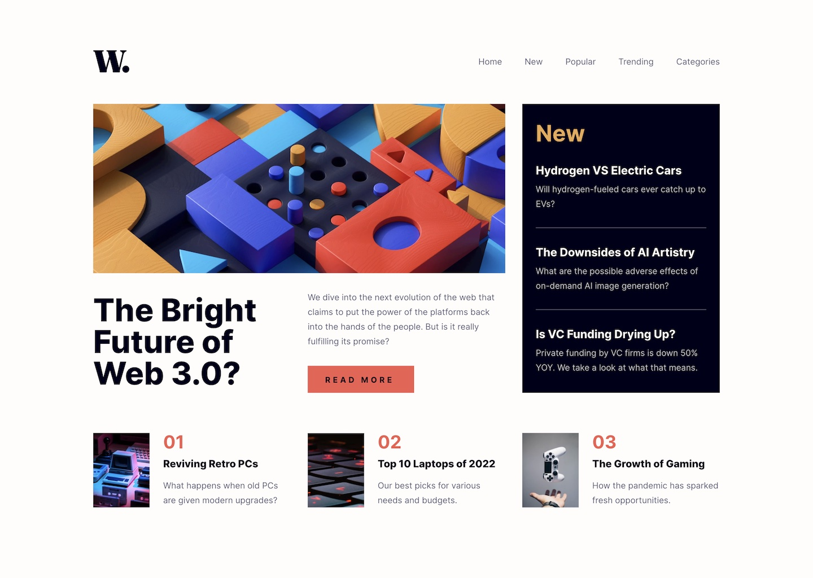

# Frontend Mentor - News homepage solution

This is a solution to the [News homepage challenge on Frontend Mentor](https://www.frontendmentor.io/challenges/news-homepage-H6SWTa1MFl). Frontend Mentor challenges help you improve your coding skills by building realistic projects. 

## Table of contents

- [Overview](#overview)
  - [The challenge](#the-challenge)
  - [Screenshot](#screenshot)
  - [Links](#links)
- [My process](#my-process)
  - [Built with](#built-with)
  - [What I learned](#what-i-learned)
- [Author](#author)

## Overview

### The challenge

Users should be able to:

- View the optimal layout for the interface depending on their device's screen size
- See hover and focus states for all interactive elements on the page

### Screenshot

### Links

- Solution URL: [https://github.com/webdevbynight/news-homepage-main](https://github.com/webdevbynight/news-homepage-main)
- Live Site URL: [https://webdevbynight.github.io/news-homepage-main/](https://webdevbynight.github.io/news-homepage-main/)

## My process

### Built with

- Semantic HTML5 markup
- CSS (via SCSS)
  - custom properties
  - logical properties
  - flexbox
  - grid
- JavaScript (via TypeScript)
- Mobile-first workflow

### What I learned

In order to use the breakpoints I named in SCSS in JavaScript, I added custom properties targeting the breakpoints to the `:root` selector. First, I wanted to use `getComputedStyle()` to retrieve the custom properties, but Chrome does not include custom properties within the object returned by such a method (Chrome 131- at the time when I wrote these lines). Instead, I used `document.styleSheets` and nested `for` loops to get the custom properties. 

## Author

- Website - [Victor Brito](https://victor-brito.dev)
- Frontend Mentor - [@webdevbynight](https://www.frontendmentor.io/profile/webdevbynight)
- Mastodon - [@webdevbynight](https://mastodon.social/webdevbynight)
